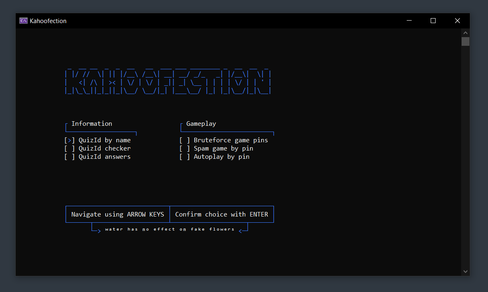

 
 
 

    

 

    <b>
        <i>
            ᴛʜᴇ ᴏɴʟʏ ᴡᴀʏ ᴛᴏ ᴘʟᴀʏ.
        </i>
    </b>

 

---

 

> :trident: **About**
>
> `Kahoofection` is a console based application, which uses Selenium and a range of bare-bone HTTP calls/Websockets for a variety of tasks related to the game/learning plattform [Kahoot](https://kahoot.com/).
>  
>  
> The goal of this application was to understand Kahoot on a deeper level and make private Kahoot games more interesting/fun.

 

> :information_source: **Information**
>
> As of 7th August 2025 the project is still work in progress and mostly finished ;)
>  
> Support for some question types within Autoplay is still outstanding.
>  
>  
> Feel free to star the repository and watch it, to get all the latest updates! :)

 

> :warning: **Disclaimer**
>
> This application was created for educational and learning purpose and is not intended to be abused in any form.
>
> This content is not affiliated with, endorsed, sponsored, or specifically approved by Kahoot and Kahoot is not responsible for it.
> In addition, you are the only person responsible for your actions when using it.

 

---

 

    

 

---

 

## Features:

QuizIdByName

 

- Every created Kahoot-Quiz will be assigned an unique id ([UUID](https://en.wikipedia.org/wiki/Universally_unique_identifier)).
- When the unique id of the quiz is known, basic information such as title, description, information about the creator or even answers for questions can be found.
- Within `Kahoofection` the steps of finding a QuizId are made more comfortable, by hiding the API calls from Kahoot behind `Kahoofection`'s simple UI.
- Based on the input, the best matching quizzes will be displayed alongside with their QuizId. 

    

 

QuizIdChecker

 

- Every created Kahoot-Quiz will be assigned an unique id ([UUID](https://en.wikipedia.org/wiki/Universally_unique_identifier)).
- When the unique id of the quiz is known, basic information such as title, description or information about the creator can be found.
- Simply enter a QuizId and all important information about a quiz will displayed within `Kahoofection`. 

    

 

QuizIdAnswers

 

- Every created Kahoot-Quiz will be assigned an unique id ([UUID](https://en.wikipedia.org/wiki/Universally_unique_identifier)).
- When the unique id of the quiz is known answers for questions can be found.
- Within `Kahoofection` the steps of finding a QuizId's answers are made comfortable by the intuitive UI.
- Simply enter a QuizId and get all the answers for this specific quiz.

    

 

PinBruteforcer

 

- Find active Kahoot-Games randomly by bruteforcing game pins and checking them live.
- `Kahoofection` is able to generate and check up to 10 generated game pins per second.
- In about 50 game pins, on average there are 2 valid game pins.

    

 

GamePinSpammer

 

- With this feature every public Kahoot-Game without 2FA can be flooded.
- First the game pin needs to be entered, after that the amount of bots and a name for them.
- Bots should typically join within ~5-10 seconds.
- Currently there is no feedback for single bots if they joined. This might be added in the future. 

    

 

Autoplay

 

- This feature allows to create a bot which is able to answer all different kinds of questions.
- It simply requires the games pin, the QuizId in use and a name for the bot.

> Note: Currently Autoplay requires the game to have no 2FA enabled.
 
- Within `Kahoofection`'s simple UI there will be constant logs to show the state of the bot.
- There are different settings to make the bot more or less detectable.
  (Combination of answer speed and accuracy)

    

 

 

---

 

## External services used
- The website [lingojam.com](https://lingojam.com/ItalicTextGenerator) was used for creating text in different fonts.
- For drawing most of the menu [Wikipedia](https://wikipedia.org/) did a great job, on serving as a documentation on [box-drawing characters](https://en.wikipedia.org/wiki/Box-drawing_characters).
- The library [Ncalc](https://github.com/ncalc/ncalc) takes the heavy lifting of evaluating any mathematical expressions within `Kahoofection`. Thanks! :)

 

---

 

## Credits
Thanks to [rawnullbyte](https://github.com/rawnullbyte) :thumbsup:
- For creating this very own "Kahoot Bot" [KahootConnect](https://github.com/HackySoftOfficial/KahootConnect).
- For documenting in such a detail on how to create Websockets and connect to the Kahoot Servers/communicate with them.
- Your project helped a lot during the development of `Kahoofection` and made a decent impact on its quality.

Thanks to [patorjk](https://github.com/patorjk) :)
- For creating this awesome website [patorjk.com](https://patorjk.com/software/taag/) which allows to create headers from normal text in different fonts and styles. It is awesome!

Thanks to [czeiffert](https://create.kahoot.it/profiles/ed8e691b-f98b-437c-8207-2fe2645bf9ae) :)
- For creating a bunch of Kahoot Quizzes, including [this one](https://create.kahoot.it/details/40f74c96-44c5-4715-b584-ac34aa1be631)
where all question types are included for testing purposes.

Thanks to [Arewzom](https://github.com/Arwezom) and [bacaala](https://github.com/bacaala) <3
- For providing their feedback and ideas which lead `Kahoofection` one step closer to perfection.

 

---
