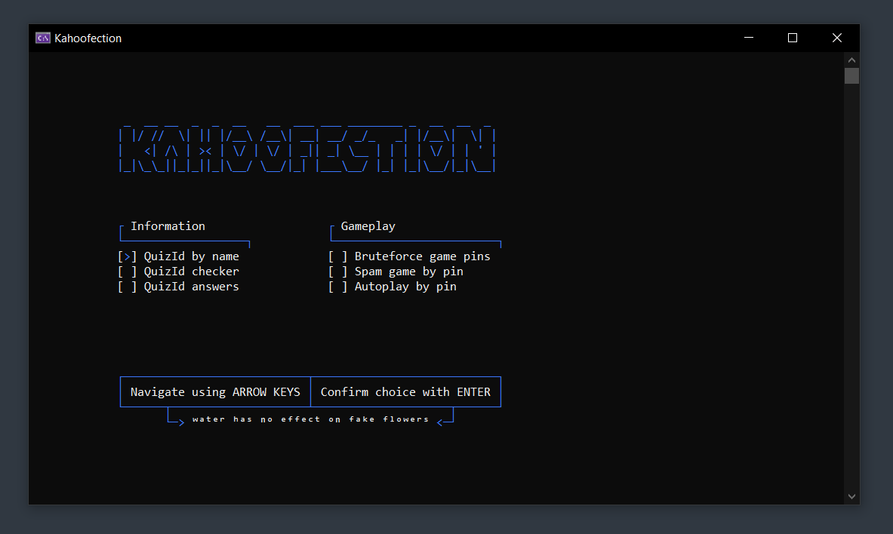

<br>

```
 _  __ __  _  _  __   __  ___ ___ ________ _  __  __  _ 
| |/ //  \| || |/__\ /__\| __| __/ _/_   _| |/__\|  \| |
|   <| /\ | >< | \/ | \/ | _|| _| \__ | | | | \/ | | ' |
|_|\_\_||_|_||_|\__/ \__/|_| |___\__/ |_| |_|\__/|_|\__|

```

<br>

`Kahoofection` is a console based application, which uses Selenium for a variety of tasks related to the game/learning plattform [Kahoot](https://kahoot.com/).

---

<br>

> :information_source: **Information**
>
> As of 7th August 2025 the project is still work in progress and mostly finished ;)
> <br>
> Support for some question types within Autoplay is still outstanding.
> <br>
> <br>
> Feel free to star the repository and watch it, to get all the latest updates! :)

<br>

> :warning: **Disclaimer**
>
> This application was created for educational and learning purpose and is not intended to be abused in any form.
>
> This content is not affiliated with, endorsed, sponsored, or specifically approved by Kahoot and Kahoot is not responsible for it.
> In addition, you are the only person responsible for your actions when using it.

<br>

---

<br>

<p align="center">
    
</p>

<br>

---

<br>

## Features:

<details>

<summary>PinBruteforcer</summary>

<br>

- Find active Kahoot games randomly by bruteforcing game pins and checking them live.
- `Kahoofection` is able to generate and check up to 10 generated game pins per second.
- In about 50 game pins, on average there are 2 valid game pins.

<p align="center">
    
</p>

</details>


---

<br>

## External services used
- The website [lingojam.com](https://lingojam.com/ItalicTextGenerator) was used for creating text in different fonts.
- For drawing most of the menu [Wikipedia](https://wikipedia.org/) did a great job, on serving as a documentation on [box-drawing characters](https://en.wikipedia.org/wiki/Box-drawing_characters).
- The library [Ncalc](https://github.com/ncalc/ncalc) takes the heavy lifting of evaluating any mathematical expressions within `Kahoofection`. Thanks! :)
<br>

## Credits
Thanks to [rawnullbyte](https://github.com/rawnullbyte) :thumbsup:
- For creating this very own "Kahoot Bot" [KahootConnect](https://github.com/HackySoftOfficial/KahootConnect).
- For documenting in such a detail on how to create Websockets and connect to the Kahoot Servers/communicate with them.
- Your project helps me a lot and will have a decent impact on the quality of `Kahoofection`.

Thanks to [patorjk](https://github.com/patorjk) :)
- For creating this awesome website [patorjk.com](https://patorjk.com/software/taag/) which allows to create headers from normal text in different fonts and styles. It is awesome!

Thanks to [czeiffert](https://create.kahoot.it/profiles/ed8e691b-f98b-437c-8207-2fe2645bf9ae) :)
- For creating a bunch of Kahoot Quizzes, incuding [this one](https://create.kahoot.it/details/40f74c96-44c5-4715-b584-ac34aa1be631)
where all question types are included for testing purposes.

Thanks to [Arewzom](https://github.com/Arwezom) and [bacaala](https://github.com/bacaala) <3
- For providing their feedback and ideas which lead `Kahoofection` one step closer to perfection.
